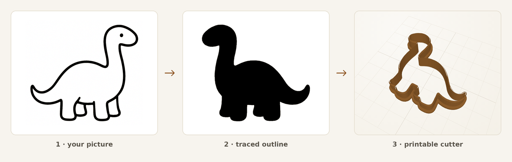
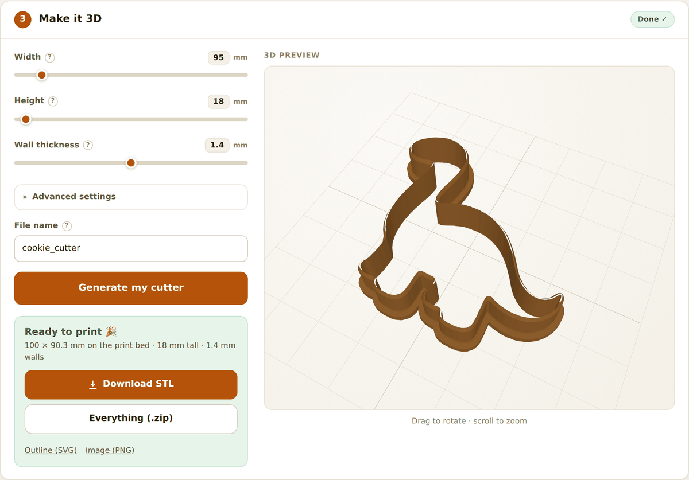
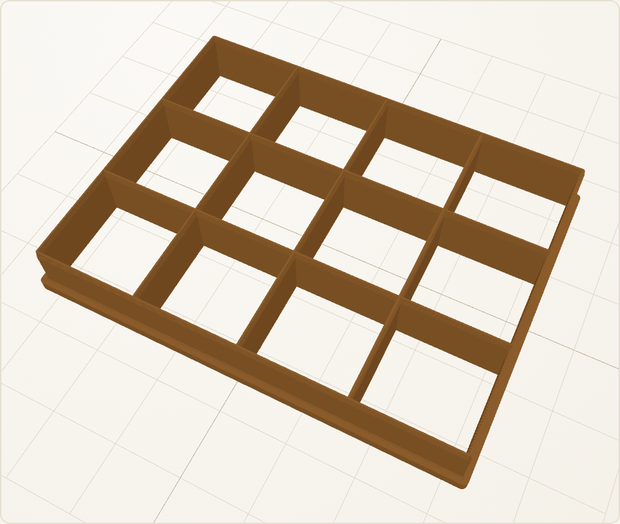

# Cookie Cutter Maker

[](https://github.com/ojaber/cookie-cutter-maker/actions/workflows/ci.yml)

Turn a picture into a 3D-printable cookie cutter. Drop in a drawing, a logo, a
photo or a 3D model, check the outline it traced, and download an STL that is
ready for your slicer.



<!-- Running a public instance? Put its URL here, right under the hero. It is
     the most useful link this page can have. -->

Everything runs on your own machine or your own server. Tracing and meshing are
local Python, and photo background removal runs locally too, with no API key
and nothing per-request leaving the box (it does fetch its model weights once
on first use; the Docker image bakes them in at build time). The one feature
that talks to a third party is the optional text-to-outline tab, and it stays
switched off unless you supply an API key.

## Run it locally

```bash
pip install -r requirements.txt
uvicorn app.main:app --port 8000
```

Open <http://localhost:8000> for the app, or `/docs` for the API.

There is a `Dockerfile` and a compose file if you would rather not install
anything:

```bash
make docker-up        # or: mkdir -p output && docker compose up --build
```

The `mkdir` matters on Linux. The container runs as a non-root user, so the
bind-mounted `output/` directory has to already exist and be writable by you
rather than by root.

Generated files land in `output/<job_id>/`.

## The web app



Three steps, in plain language. Pick a shape, check the outline that was traced
from it, then set the size and generate. The measurements that matter (width,
height, wall thickness) are on the surface; the fiddly ones (cutting edge
profile, grip rim, corner rounding) live behind an "Advanced settings"
disclosure so they are there when you want them and out of the way when you
don't.

Every setting is labelled in millimetres with a tooltip explaining what it does
to the print. The result panel reports the real measured footprint of the
finished mesh, not the number you asked for, because the grip rim makes the
part a few millimetres larger than the outline. There is a light and a dark
theme, and it works on a phone.

## Four ways to make a shape

### A picture

PNG or JPG. Line art and clip art trace best: a black shape on a white
background needs no help at all. Logos and drawings work well on any plain
background. Photographs work too, with the background removed on the server by
[rembg](https://github.com/danielgatis/rembg); when that is switched off the
pipeline falls back to Felzenszwalb graph-cut segmentation, which is faster and
less accurate.

You can drag a file in, click to browse, or paste an image straight from your
clipboard.

### A 3D model

Upload an STL and it is viewed from directly above and traced into a 2D
outline, which then goes through the same path as a picture.

### A grid



For brownie, fudge and dough-strip dividers you do not need a picture at all.
The Grid Builder takes columns, rows and an exact cell size in millimetres and
builds the walls directly, so the cells come out at the size you asked for
instead of being scaled to fit a target width.

Connected grid line art (tic-tac-toe style) is also detected automatically in
uploaded images and built the same way. Shape mode is set to Auto by default
and can be forced either way.

### A text prompt

Set `OPENAI_API_KEY` and the "From text" tab will draw a simple outline from a
description using the OpenAI Images API, then trace it like any other picture.
Without a key the tab is shown as unavailable and the endpoint returns HTTP
402, so the rest of the app is unaffected.

## Command line

The pipeline runs without the web app:

```bash
# from a picture
python -m cutter_pipeline.cli --png examples/pajama_outline.png --outdir output --name pajama

# from a 3D model
python -m cutter_pipeline.cli --stl examples/dino.stl --outdir output --name dino_cutter

# a 4x3 divider grid with 30 x 25 mm cells, no input file
python -m cutter_pipeline.cli --grid 4x3 --cell-mm 30 --cell-h-mm 25 --outdir output --name brownie_grid

# from a description (needs OPENAI_API_KEY)
python -m cutter_pipeline.cli --prompt "a heart shape silhouette" --outdir output --name heart
```

The HTTP API mirrors this. Each source has a two-step form (`/trace/from-png`,
`/trace/from-stl`, `/trace/from-grid`, then `/stl/from-job`) so you can retrace
and re-mesh without re-uploading, and a one-shot form that returns the STL and
a zip in a single call:

```bash
curl -X POST http://localhost:8000/pipeline/from-grid \
  -F cols=4 -F rows=3 -F cell_w_mm=30 -F cell_h_mm=25 -F name=brownie_grid
```

Full schemas are at `/docs`.

## Hosting it publicly

The defaults assume the instance is reachable from the open internet:

- **Abuse guards are on out of the box.** Per-IP rate limiting
  (`RATE_LIMIT_PER_MINUTE`) and a cap on concurrent pipeline jobs
  (`HEAVY_CONCURRENCY`) keep a small instance standing during a burst. Both are
  in-memory and per-process, which is correct for the default single-instance
  deploy. Run one uvicorn worker, or put a real rate limiter in front, if you
  scale out.
- **Uploads are bounded** by `MAX_UPLOAD_BYTES` and a decompression-bomb guard,
  and jobs are swept after `JOB_TTL_HOURS` so the disk cannot fill.
- **Security headers** (CSP, `X-Frame-Options`, `nosniff`, referrer policy) are
  set on every response, and `robots.txt` keeps crawlers out of `/files/`.
- Want it semi-private? Set `ACCESS_PASSWORD` and `SESSION_SECRET` and the app
  puts a passphrase page in front of everything.

### Free tier, in about three minutes

The repo ships a `render.yaml` blueprint for [Render](https://render.com),
which runs it as a native Python service with no Docker image and no credit
card. Sign in with GitHub, choose **New → Blueprint**, pick this repo, and
click **Apply**. It redeploys on every push to the branch you choose.

Three things to know about the free plan:

- **512 MB of RAM**, so the blueprint sets `REMBG_ENABLED=false`. Photo
  background removal loads a ~170 MB U2Net model and will not fit. Outlines,
  logos and photos on a plain background all still work.
- **It sleeps after about 15 minutes idle** and takes roughly a minute to wake.
  The app retries through the wake-up rather than showing an error.
- **The disk is ephemeral.** A restart wipes every job directory. The browser
  keeps your source image and settings and rebuilds the job automatically, so
  you should never hit a dead end, but download links from an earlier session
  will stop working.

For photo AI and no sleeping, any container or Python host works: Cloud Run,
Fly.io, Railway, a small VPS. Use the full `requirements.txt` and the
`Dockerfile` there.

## Configuration

| Variable | Default | Description |
|---|---|---|
| `OPENAI_API_KEY` | _(unset)_ | Enables text-to-outline generation via the OpenAI Images API. Unset, the "From text" tab is shown as unavailable and the endpoint returns HTTP 402. |
| `REMBG_ENABLED` | `true` | Background removal for photographic images. Set `false` to fall back to Felzenszwalb graph-cut segmentation, which is faster and less accurate. Turn it off below ~2 GB of RAM; rembg loads a ~170 MB U2Net model at startup. |
| `PIPELINE_OUTPUT_DIR` | `output` | Where generated job files (PNG, SVG, STL, ZIP) are written. |
| `JOB_TTL_HOURS` | `24` | Job directories older than this are swept in the background. `0` keeps them forever. |
| `MAX_UPLOAD_BYTES` | `20971520` | Largest accepted upload (20 MB). |
| `MAX_TRACE_PIXELS` | `2000000` | Bigger images are downscaled before tracing. Peak memory scales with pixel count, since the extractor works in LAB float64 at 24 bytes per pixel, so a 12 MP phone photo would otherwise peak near 1 GB and OOM a small instance. Outlines are normalised to 0–1 and simplified, so the extra resolution changes nothing in the result. `0` disables. |
| `ACCESS_PASSWORD` | _(unset)_ | Puts the whole app behind a passphrase login. Leave unset for an open site. |
| `SESSION_SECRET` | _(unset)_ | Signs login cookies when `ACCESS_PASSWORD` is set. Any long random string; setting it lets sessions survive restarts and replicas. |
| `RATE_LIMIT_PER_MINUTE` | `20` | Heavy pipeline POSTs allowed per client IP per minute, HTTP 429 beyond that. `0` disables. |
| `HEAVY_CONCURRENCY` | `2` | Trace and mesh jobs allowed at once. Extra requests queue briefly, then get HTTP 503. `0` disables. |
| `HEAVY_QUEUE_TIMEOUT_SECONDS` | `30` | How long a request waits for a free job slot before giving up with a 503. |
| `FRAME_ANCESTORS` | `'self'` | CSP `frame-ancestors`, i.e. who may embed the app in an iframe. Set e.g. `'self' https://example.com` to allow embedding elsewhere. |

## How the cutter is shaped

The inner face is a constant profile the whole height of the cutter, so the cut
follows your traced outline exactly however thick you make the wall or however
wide the grip rim. All the shaping happens on the outside: the rim steps
outward at the base, and the wall tapers inward to a thin edge at the cutting
end.

That puts the widest, flattest surface at `z=0`, so it prints rim-down on the
bed with no supports and the cutting edge pointing up.

Sharp corners are rounded by a configurable amount before the walls are built,
because an unmodified sharp corner pinches the wall down to a point too thin to
print. Disconnected specks below a minimum area are dropped for the same
reason.

One thing that surprises people: many slicers display a closed solid with a
void inside as if it were solid. Use section or cut view to confirm the cavity
is really there.

## Tests

```bash
pip install -r requirements.txt
pytest
```

CI additionally runs a smoke test end to end, from a picture to an STL on disk
and from a grid spec to an STL on disk.

## License

MIT. Original project © seaburr, modifications © ojaber. See `LICENSE`.
